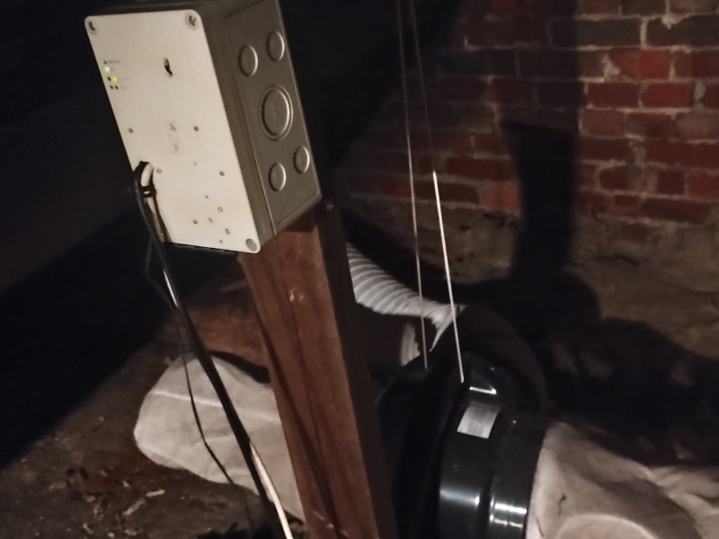

# ventilation-system

This is a project based on [Raspberry Pi Pico 2
W](https://www.raspberrypi.com/documentation/microcontrollers/pico-series.html)
which controls a Vent-Axia positive input ventilation (PIV) system.

The project is provided as an example of the use of my
[pico-wifi-settings library](https://github.com/jwhitham/pico-wifi-settings)
which supports "internet of things" (IoT) remote control projects
by enabling remote reconfiguration and firmware updates.

pico-wifi-settings manages WiFi connections for Pico firmware. Using the library,
I can update the configuration of the ventilation controller without needing
to climb into the loft, unscrew the box or physically connect to Pico. I could,
for example, change my WiFi password or hotspot name, or set different
threshold temperatures for the ventilation.

With pico-wifi-settings I'm even able to upload new firmware, so I can add
new features and fix bugs without physical access, which was very important
in the first week of operation as I integrated it with existing home automation
systems and fixed some problems (see 'Difficulties', below).

# Background

The [Vent-Axia Lo-Carbon Pure Air Home Positive Input Ventilation
(PIV)](https://www.vent-axia.com/range/lo-carbon-pureair-home) system is intended
to create positive air pressure within a house, improving air quality and reducing
the possibility of mould and damp. The system doesn't actually require any external
automation and comes with configuration options of its own. These allow a maximum
operating temperature to be configured, but the minimum is fixed at -5°C,
which I found extremely cold. During the winter of 2025 I installed a frost stat
to prevent my house being filled with freezing air by switching off the PIV when
temperatures fell below about +3°C.

However, I was not happy with this simple solution. I would have preferred some
kind of remote control. In the summer, I also found a need for the
"boost" option, which increases the fan speed, but again requires a remote control of
some kind (at the very least, a switch on a lower floor).

# ventilation-system project

[Raspberry Pi Pico 2
W](https://www.raspberrypi.com/documentation/microcontrollers/pico-series.html)
provides a great platform for this project. If anything, it is far more powerful than necessary.
This project uses only one of the CPU cores, underclocks the CPU to 48MHz to save
energy, and uses only 10% of the available memory.

The Pico 2 W is a low-cost device. It connects to WiFi, which provides the remote control
features that I wanted, and it connects easily to simple electronics such as LEDs,
transistors and thermistors, which allow it to control other devices and react to changes
in the environment. I reused a box from a previous generation of home automation,
a heating controller that had once used an original Raspberry Pi model A, and I reused
the LEDs and relays from that device too.

The box:

The device has the following features:

- It frequently samples the ambient temperature using a thermistor.
- In automatic mode, it provides power to the PIV when the temperature is within
  a configured range (neither too hot nor too cold).
- Manual mode can be activated remotely using a UDP message, and in manual mode,
  the PIV may be "off", "on", or "on with boost".
- The status of the system is shown on six front-panel LEDs and is also
  reported via periodic UDP messages.

# Hardware design

The circuit diagram:

I put most of the hardware onto a single piece of stripboard with 2.54mm spacing
to match the Pico pins. The Pico plugs into a PCB socket which allows it to be removed
if necessary: although the firmware can be updated over WiFi with pico-wifi-settings,
it's very possible to send a bad update which won't boot, in which case the Pico would
have to be removed and reprogrammed by USB.

The board layout:

I use PCB sockets for all external
connections, as this makes the hardware quite modular, allowing parts to be unplugged
as necessary for debugging and maintenance. Devices such as relays, LEDs and the
mains PSU are all connected to the board using DuPont-style connectors, so they
plug in like breadboard wires.

The board also hosts a tiny DC-DC "buck" converter which steps the voltage
down from 12V to 4V. A 12V supply is needed to operate the relays, but it's too
much for Pico 2 W, so this converter reduces the voltage appropriately.

I am particularly pleased with [the LED driver which controls six LEDs with just
three wires](fw/leds.c). This uses the Pico 2 W's "PIO" feature to step through the
combinations for each I/O pin (on, off, high impedance) such that the LEDs are lit
in turn. Every wire is a potential cause of failure, and a lot of wiring is a real pain
when constructing and debugging, so anything that reduces wires is welcome.

Because of [pico-wifi-settings](https://github.com/jwhitham/pico-wifi-settings),
I was able to complete the physical installation of the device in the loft
before writing much of the firmware, which is arguably still unfinished! The first
version did not use the thermistor correctly and just allowed some limited
manual control.

# Software build and deploy 

You'll need the [Pico SDK](https://github.com/raspberrypi/pico-sdk/) to build.

- use `setup.sh` to run the CMake configuration step
- use `build.sh` to build

In my working copy, I have two additional files in the repository root:
`wifi-settings-file` and `remote_picotool.cfg`. These are based on the sample
files `wifi-settings-file.sample` and `remote_picotool.cfg.sample` but I have
added my own WiFi details and shared secret. These allow me to use the following
commands:

- `./remote_picotool.py update_reboot wifi-settings-file` to upload
  the wifi-settings-file to the Pico: for example, to add a new WiFi hotspot
  or change one of the temperature thresholds.
- `./remote_picotool.py ota build/fw/main.uf2` to upload new firmware to the Pico.
- `python remote_status.py` to get a status report containing the temperature and
  internal status of the ventilation controller.

# Costs

As I was able to use parts that I already had, I am unsure of the exact cost of the
project. The PIV unit cost about £330 from Screwfix, less than half the manufacturer's
RRP, and I installed it myself, using a Dremel to cut a circular hole in the ceiling.
I did not buy the special "boost" cable sold by Vent-Axia for about £100, and instead
just used two DuPont-style female connectors to plug directly into the boost socket
on the front panel of the PIV unit, having found a suggestion about this in an
online forum. The only other parts that I needed to buy were the Pico 2 W (£6.60
from the Pi Hut) and a small switch-mode PSU (£5 from an ebay seller).

# Difficulties

It's important to have the data sheet for a thermistor, because this has the
coefficients that relate the resistance to the temperature. I do not know what
sort of thermistor I used here, but I had to find the "beta" value by experimentally
comparing with values from a thermistor of known type.

The ADC input to the Pico 2 W seems to pick up a lot of noise, and I'm not sure why - there is
always some noise in analogue measurements but the error is much greater than I'd expect (+/- 5°C).
I suspect it is caused by power supply noise, but I have not confirmed this. To deal with the problem,
I added code to average the input across a lot of samples. After a few problems with the firmware
spuriously detecting a "hot" or "cold" condition due to +/- 5°C variations in the temperature
reading, I changed the firmware to [store 100 samples
and calculate the mean](fw/temperature.c), making the temperature data quite smooth.
The following graph shows the difference between the raw samples and the mean across
a 24 hour time period:

I tried a similar experiment on another Pico 2 W with a different power supply,
and found there was still some noise,
less significant (+/- 1°C), but still large enough to justify averaging many samples:

It's not exactly related to this project, but as a general note, a PIV unit will make a lot of noise
if directly mounted on the ceiling joists in a free-standing configuration.
It should hang down from above. The Vent-Axia installation kit provides both options,
and I initially tried the free-standing configuration, but the humming noise of the
fan was quite audible from the room below. The system is effectively silent when hanging down.

